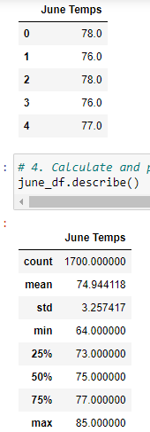
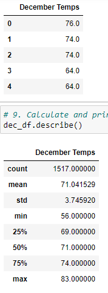

#Surf's Up overview of statistical analysis
	using the information we have learned from python, pandas functions and methods, and SQLAlchemy we will convert the temperatures to a list, create a DataFrame from the list, and generate the summary statistics from when we filter the date column of the Measurements table in the hawaii.sqlite database to retrieve all the temperatures for the month of June and December 2017.
##Results
	The three key differences in weather between June and December are:
	-min is the biggest difference in temperature (june at 71 and dec at 74)
	-theres a 10 degree difference between the beginning of December 
	-june has a 5 degree difference in temperature
  
  
#Summary
	The two additional queries added to perform to gather more weather data for June and December by using the tail function. By using this function I am able to see more of a difference in the temperature for Hawaii.
